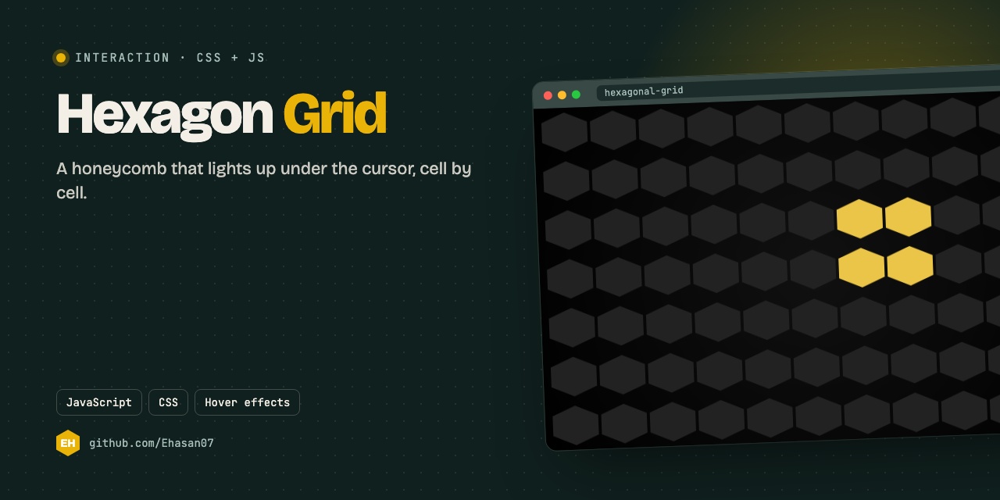
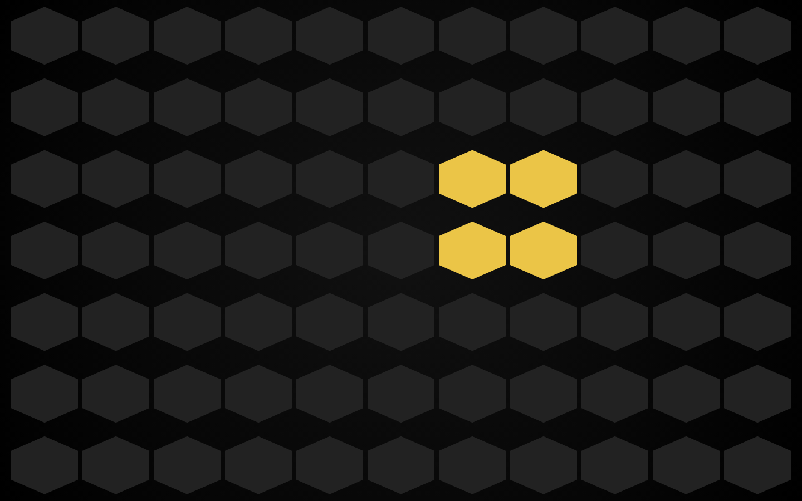

<p align="center"></p>

<p align="center"><a href="#screenshot">Screenshot</a> · <a href="#run-it">Run it</a></p>

## About

A honeycomb of hexagons that light up under the cursor.

## What it does

- Full-screen hexagon grid
- Cells near the pointer glow and fade back
- Built with CSS shapes and a little JavaScript

## Screenshot

<p align="center"></p>

## Built with

HTML · CSS · vanilla JavaScript

## Run it

No build step. Open `index.html` in a browser, or serve the folder:

```bash
npx serve .
```

---

<p align="center"><sub>Made by <a href="https://github.com/Ehasan07">S M Ehasanul Haque</a> · Dhaka, Bangladesh · <a href="https://ehasanlive.com">ehasanlive.com</a></sub></p>
